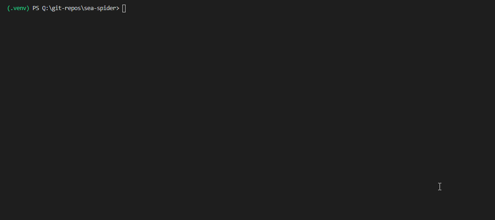

# sea-spider
A humble SEO spider and link checker

# Usage
## Initial setup
```
pip install -r requirements.txt
python setup.py
```

## Basic example
```
python seaspider.py https://google.com
```



## Example with domain restriction
You can limit crawling to a specific domain by providing a second parameter, the domain name.
```
python seaspider.py https://google.com google.com
```
