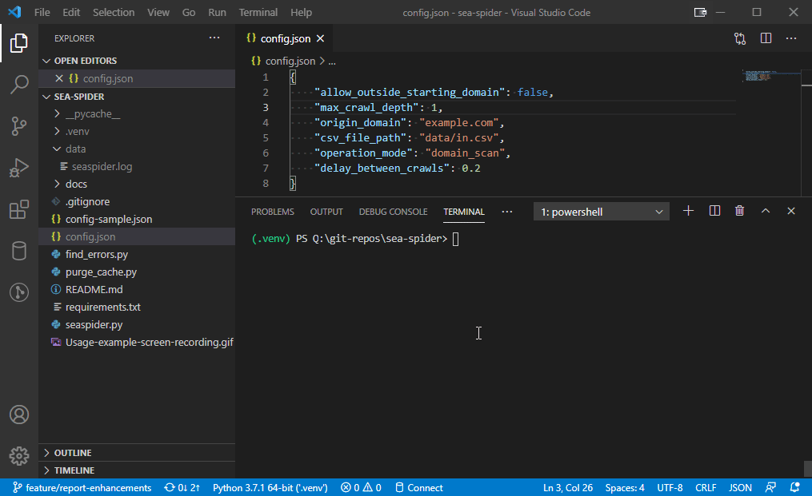

# sea-spider
A humble SEO spider and link checker

# Usage
## Initial setup
### Install dependencies
```
pip install -r requirements.txt
```
### Config file setup
1. Rename ```config-sample.json``` to ```config.json```
2. Set the ```origin_domain``` value in ```config.json``` to your site
```
config.json
"origin_domain": "example.com",
```
## Basic example
```
python seaspider.py
```



## Advanced usage
### Domain restriction
This is on by default. It prevents the spider from crawling URLs outside a given domain.
```
config.json
"allow_outside_starting_domain": false,
"origin_domain": "example.com",
"operation_mode": "domain_scan"
```
### Increasing crawl depth
The ```max_crawl_depth``` setting controls how many levels of links the spider will recursively crawl (crawls a page, harvests its links, starts crawling each of those links, repeating until the max depth is reached).

⚠ Warning: Depending on the number of total links, unique links your crawl network generates, the computational expense of traversing the entire network increases exponentially as the max crawl depth increases.
```
config.json
"max_crawl_depth": 5,
```
